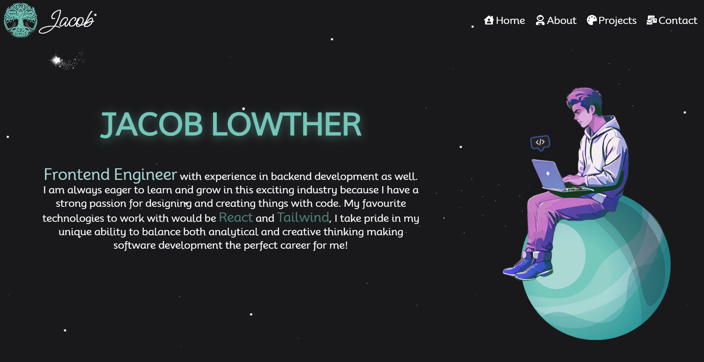
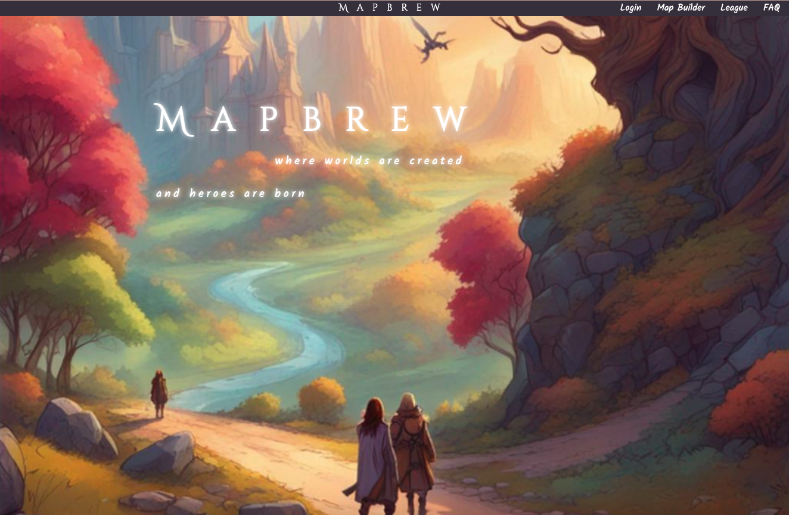
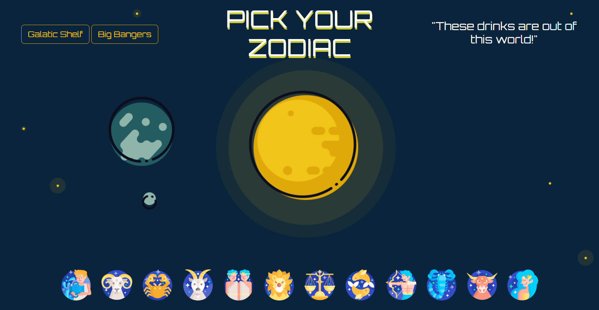
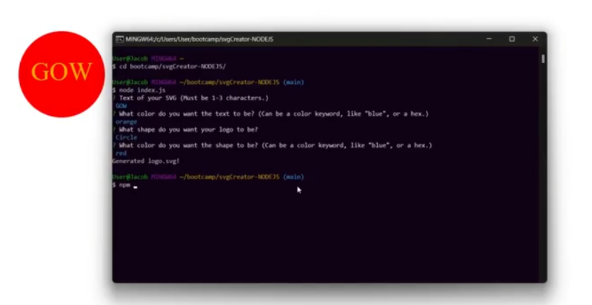

# Jacob Lowther - Portfolio

[Click me](www.jacoblowther.com) to view live demo!

## Description

This is a personal portfolio website showcasing my work and projects, while also being a place to learn more about me.

## About Me

I'm Jacob Lowther, a passionate Frontend Engineer based in New Brunswick, Canada. With a strong background in full-stack development, I'm on a mission to craft innovative and visually appealing web applications. My journey into the world of coding began at a young age, and it's been an exciting ride ever since.

- 🔭 Currently, I'm pursuing a Full Stack Development bootcamp to enhance my skills.

- 📚 I'm always learning new things and expanding my knowledge.

- 🤝 I'm always looking for opportunities to collaborate with like-minded individuals.

- 🌱 I have a deep love for React.js and Tailwind CSS.

- 🚀 Balancing analytical and creative thinking is my forte, making software development the perfect career choice for me.

## Projects

### Mapbrew Haven

Mapbrew Haven is your go-to tool for tabletop RPG maps. Craft and download your own maps to add a personalized touch to your sessions!

- [Live Demo](https://mapbrew-websitee-20a575919a4b.herokuapp.com/login)
- [GitHub Repository](https://github.com/YggdrasilJL/mapbrew-haven)

### Cosmic Cocktails

Cosmic Cocktails is a unique platform that mixes astrology with mixology. Discover a surprise cocktail tailored to your zodiac sign with each click!

- [Live Demo](https://graycoded.github.io/cosmic-cocktail-2.0)
- [GitHub Repository](https://github.com/YggdrasilJL/cosmic-cocktails)

### SVG Creator

A simple and straightforward tool that empowers you to effortlessly create custom SVG images from the command line using inquirer.

- [GitHub Repository](https://github.com/YggdrasilJL/svgCreator-NODEJS)

## Technologies I've Worked With

I've had the pleasure of working with a range of technologies, including:

- HTML
- CSS
- JavaScript
- Node.js
- React.js
- Tailwind CSS

## Contact

Feel free to reach out to me if you'd like to collaborate or have any questions:

- Email: yggdrasiljl@gmail.com

- LinkedIn: [Jacob Lowther](https://www.linkedin.com/in/jacob-lowther)

- GitHub: [YggdrasilJL](https://github.com/YggdrasilJL)
